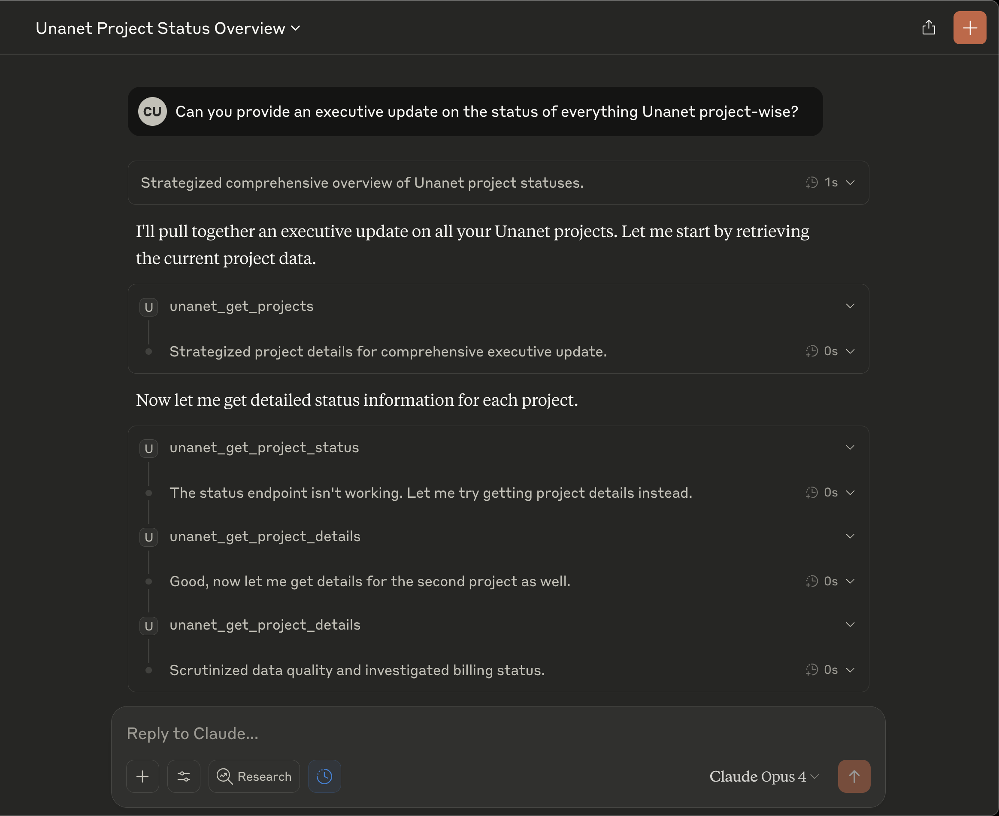
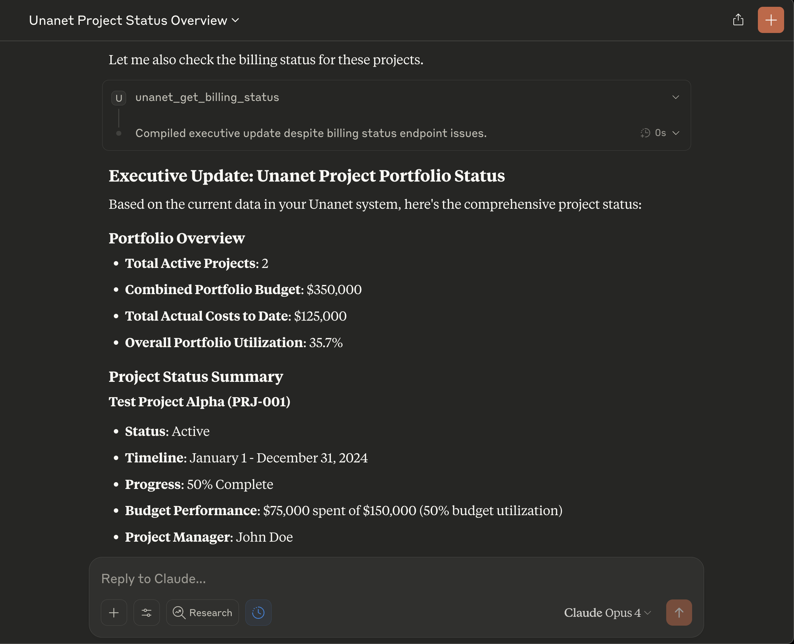

# Unanet GovCon ERP MCP Server

**Transform your 30-minute Unanet reports into 30-second conversations with AI**

## 🎯 For GovCon Leaders Who Are Tired Of:
- Clicking through 10 screens to answer one question
- Waiting 20 minutes for reports that should take 20 seconds
- Training new employees on complex ERP navigation
- Missing critical project updates buried in data

## 🚀 What if you could just ask: "Give me an executive briefing on all projects"?


### ⏱️ Save 2-4 hours per week on ERP tasks:
- **Project Managers:** Instant status updates, resource allocation checks, budget tracking
- **Executives:** Daily briefings in seconds, not spreadsheets
- **Finance Teams:** Real-time billing status, instant invoice generation
- **Everyone:** No more clicking through 10 screens to find one answer

## 💡 See It In Action

### From Complex Navigation to Simple Questions

**Before:** Log in → Projects → Select Project → Export → Format in Excel → Write Summary (15-30 min)

**After:** "What's the status of all active projects?" (30 seconds)




## 🎯 Quick Start

**For Windows Users:** Download → Run `setup-windows.bat` → Done! [Detailed Guide](README-WINDOWS.md)

**For Technical Users:** See [Installation](#installation) below

## 🎯 What You Can Do

Ask Claude natural questions about your Unanet data:

✅ **"Show me all projects over budget"**
✅ **"Submit 8 hours to Project Alpha for today"**
✅ **"Generate a compliance report for Q4"**
✅ **"Which team members are overallocated next month?"**
✅ **"Create an invoice for project DEF456"**

No more memorizing menu paths or waiting for reports to load!

## 💰 ROI & Time Savings

Based on real GovCon operations:
- **Project Managers:** Save 2-4 hours per week
- **Executives:** Save 1-2 hours daily on status updates
- **Finance Teams:** Cut monthly billing reconciliation time by 75%
- **Everyone:** Get answers in seconds, not minutes

### Real Example: Executive Daily Briefing

**Traditional Method:** Run reports → Export data → Analyze → Format (20+ minutes)
**With Claude:** "Give me an exec daily briefing" (30 seconds)

```
Executive Daily Briefing - Unanet Projects

• Portfolio Health: 2 active projects ($350K total budget) tracking on schedule
• Project Alpha: 50% complete with proportional budget burn - entering critical phase
• Project Beta: Early stage execution at 25% complete, healthy trajectory
• Resource Status: Team allocation stable, no conflicts identified
• Risk Assessment: All projects green status

Recommended Action: Schedule mid-project review for Alpha this week
```



📸 **[See More Power User Examples](docs/POWER-USER-SCREENSHOTS.md)**

## Features

### Tools Available

#### Project Management
- `unanet_get_projects` - List all projects with filtering options
- `unanet_get_project_details` - Get detailed information about a specific project
- `unanet_update_project_budget` - Update project budget
- `unanet_get_project_status` - Get project status and dashboard metrics

#### Time & Expense Tracking
- `unanet_submit_timesheet` - Submit time entries
- `unanet_get_timesheets` - Retrieve timesheets for a date range
- `unanet_submit_expense` - Submit expense reports
- `unanet_approve_timesheet` - Approve submitted timesheets

#### Contact Management
- `unanet_create_contact` - Create new contacts
- `unanet_update_lead` - Update lead information
- `unanet_create_opportunity` - Create new opportunities
- `unanet_get_company_info` - Get company details

#### Financial Operations
- `unanet_get_billing_status` - Get project billing information
- `unanet_generate_invoice` - Generate project invoices
- `unanet_get_financial_report` - Generate various financial reports

### Resources Available
- `unanet://projects/active` - List of active projects
- `unanet://timesheets/templates` - Timesheet templates and common entries

## Installation

### 🪟 Windows Users (Recommended)

1. **Download the project**:
   - Download from GitHub as a ZIP file
   - Extract to `C:\UnanetMCP\`

2. **Run the automated setup**:
   - Double-click `setup-windows.bat`
   - Follow the prompts

That's it! See [Windows Setup Guide](README-WINDOWS.md) for detailed instructions.

### 🐧 Mac/Linux Users

1. Clone this repository:
```bash
git clone https://github.com/culstrup/unanet-mcp-server.git
cd unanet-mcp-server
```

2. Install dependencies:
```bash
npm install
```

3. Build the project:
```bash
npm run build
```

4. Set up your environment variables:
```bash
cp .env.example .env
# Edit .env with your Unanet credentials
```

## Configuration

### Environment Variables

Create a `.env` file with your Unanet credentials:

```env
UNANET_USERNAME=your-username
UNANET_PASSWORD=your-password
UNANET_API_KEY=your-api-key
UNANET_FIRM_CODE=your-firm-code
UNANET_BASE_URL=https://your-instance.unanet.com
```

### Claude Desktop Configuration

Add the following to your Claude Desktop configuration file:

**macOS**: `~/Library/Application Support/Claude/claude_desktop_config.json`
**Windows**: `%APPDATA%\Claude\claude_desktop_config.json`

```json
{
  "mcpServers": {
    "unanet": {
      "command": "node",
      "args": ["/absolute/path/to/unanet-mcp-server/dist/index.js"],
      "env": {
        "UNANET_USERNAME": "your-username",
        "UNANET_PASSWORD": "your-password",
        "UNANET_API_KEY": "your-api-key",
        "UNANET_FIRM_CODE": "your-firm-code",
        "UNANET_BASE_URL": "https://your-instance.unanet.com"
      }
    }
  }
}
```

## Usage Examples

Once configured, you can interact with Unanet through Claude:

### Project Management
```
"Show me all active projects"
"Get details for project ABC123"
"Update the budget for project XYZ to $150,000"
"What's the status of the government contract project?"
```

### Time Tracking
```
"Submit 8 hours for project ABC123 for today"
"Show my timesheets for last week"
"Approve timesheet TS-2024-001"
```

### Financial Reports
```
"Generate a project profitability report for Q4"
"Show billing status for project DEF456"
"Create an invoice for the last billing period"
```

### Contact Management
```
"Create a new contact: John Smith from ABC Corp"
"Update the lead status to 'Proposal' with 75% probability"
"Create a new opportunity worth $500k closing next month"
```


## Development

### Running in Development Mode
```bash
npm run dev
```

### Project Structure
```
src/
├── index.ts           # Main server entry point
├── auth.ts            # Authentication handling
├── tools/             # MCP tool implementations
│   ├── projects.ts    # Project management tools
│   ├── timesheet.ts   # Time/expense tools
│   ├── contacts.ts    # Contact management
│   └── financials.ts  # Financial tools
├── resources/         # MCP resource providers
│   └── reports.ts     # Report resources
└── types/             # TypeScript type definitions
    └── unanet.ts      # Unanet API types
```

### Adding New Tools

1. Create a new tool in the appropriate file under `src/tools/`
2. Export the tool definition with:
   - `name`: Unique tool identifier
   - `description`: Clear description of what the tool does
   - `inputSchema`: Zod schema for input validation
   - `handler`: Async function that executes the tool
3. Import and add the tool to the `tools` array in `src/index.ts`

## Security Considerations

- Never commit your `.env` file
- Use environment variables for all sensitive data
- The server implements rate limiting protection
- All API calls use HTTPS
- Credentials are transmitted using Basic Auth + API Key

## Troubleshooting

### Authentication Errors
- Verify your credentials in the `.env` file
- Ensure your API key has the necessary permissions
- Check that your firm code is correct

### Connection Issues
- Verify the `UNANET_BASE_URL` is correct
- Check network connectivity
- Ensure the Unanet API is accessible from your network

### Claude Desktop Integration
- Restart Claude Desktop after configuration changes
- Check the logs for any MCP connection errors
- Verify the absolute path to the server is correct

## Support

For issues or questions:
1. Check the Unanet API documentation
2. Review the MCP documentation at https://modelcontextprotocol.io
3. Open an issue in this repository

## 🎯 Getting Started Today

**Option 1: Quick Setup (Windows)**
1. Download this repository
2. Run `setup-windows.bat`
3. Start asking Claude about your Unanet data!

**Option 2: Manual Setup**
See [Installation](#installation) for Mac/Linux or advanced setup

## 💬 Join the Conversation

Are you using AI to transform your GovCon operations? Let's connect!

- 🌟 Star this repo if you find it useful
- 🔄 Share your Unanet automation success stories
- 💡 Suggest features or improvements via Issues

## About GSD at Work LLC

We help GovCon CEOs integrate AI into their core business operations and accelerate growth. From DoD contractors to civilian agencies, we're transforming how government contractors work.

**What We Do:**
- AI Strategy & Implementation for GovCons
- ERP Integration & Automation
- Custom AI Solutions for Compliance & Operations

**Let's Talk:** christian@gsdat.work | [gsdat.work](https://gsdat.work)

---

*Because your time should be spent winning contracts, not wrestling with ERPs.*

## License

MIT License - Copyright (c) 2025 GSD at Work LLC - See LICENSE file for details