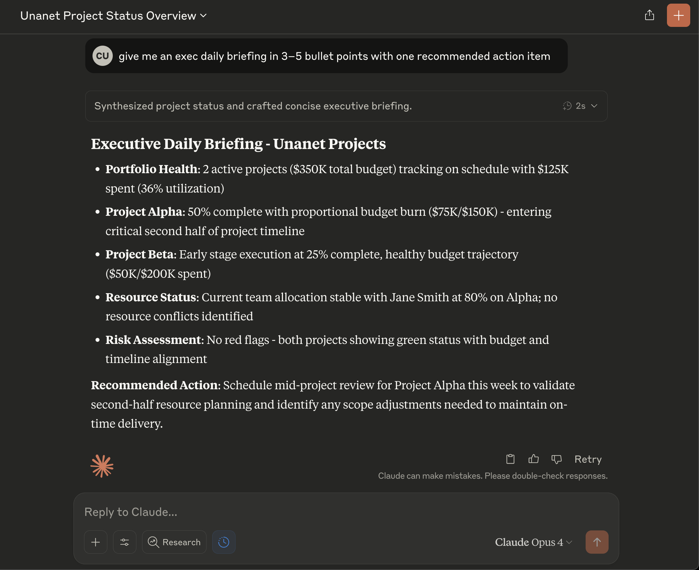

# Power User Screenshots

This document contains screenshots demonstrating real-world usage of the Unanet MCP Server with Claude Desktop.

## Executive Status Update Example

*User Query: "Can you provide an executive update on the status of everything Unanet project-wise?"*

This screenshot shows how Claude:
1. Automatically calls `unanet_get_projects` to retrieve all projects
2. Attempts to get detailed status for each project
3. Compiles a comprehensive executive summary with portfolio metrics

## Executive Daily Briefing Example

*User Query: "Give me an exec daily briefing in 3-5 bullet points with one recommended action item"*

This screenshot demonstrates:
- Concise, actionable intelligence formatted for executive consumption
- Automatic risk assessment and resource status
- Specific recommended actions based on current project state

## Billing Status Integration

*The system attempting to retrieve billing information alongside project data*

This shows the comprehensive nature of the integration, attempting to pull financial data to provide complete project visibility.

## Key Benefits Demonstrated

1. **Natural Language Interface**: No need to remember specific report names or navigation paths
2. **Intelligent Data Aggregation**: Claude automatically determines which tools to use
3. **Executive-Ready Formatting**: Output is pre-formatted for immediate use
4. **Time Savings**: What typically takes 15-30 minutes is done in seconds
5. **Consistency**: Same format every time, reducing cognitive load

## Setup for Screenshots

To capture similar screenshots for your organization:
1. Ensure the mock server is running for demonstrations
2. Use real project data (with appropriate permissions) for actual usage
3. Save screenshots of particularly useful queries for training materials